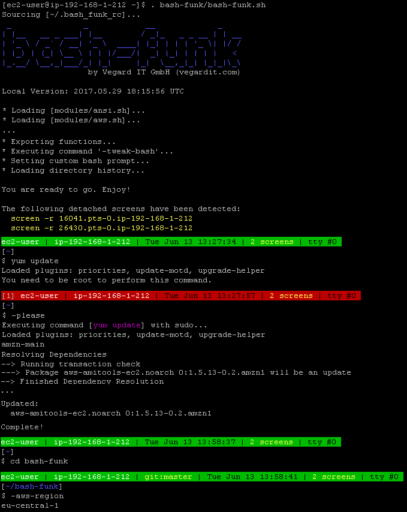
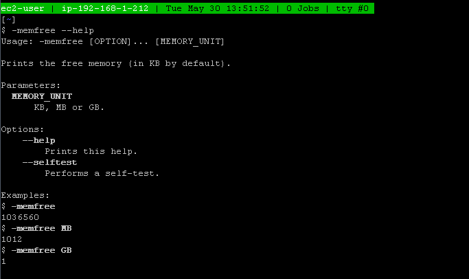
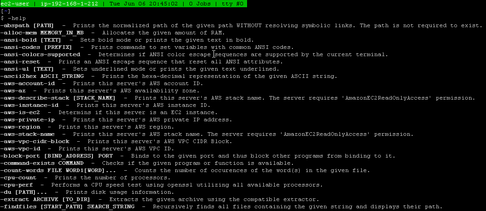

# bash-funk - Spice up your Bash!

1. [What is it?](#what-is-it)
1. [Installation](#install)
1. [Usage](#usage)
1. [License](#license)


## <a name="what-is-it"></a>What is it?

bash-funk is a collection of useful commands for Bash 3.2 or higher.

See the markdown files of the different [Bash modules](https://github.com/vegardit/bash-funk/tree/master/modules) for detailed information about the provided commands.

An enhanced bash prompt is provided too:



All bash-funk commands have a descriptive online help:



The command `-help` shows a list of all available commands



## <a name="install"></a>Installation

###  Using Git

Execute:
```
git clone https://github.com/vegardit/bash-funk --branch master --single-branch ~/bash-funk
```


###  Using Subversion

Execute:
```
svn checkout https://github.com/vegardit/bash-funk/trunk ~/bash-funk
```

###  Using Curl

Execute:
```
mkdir ~/bash-funk && \
cd ~/bash-funk && \
curl -#L https://github.com/vegardit/bash-funk/tarball/master | tar -xzv --strip-components 1
```

## <a name="usage"></a>Usage

Once bash-funk is installed, it can be used by sourcing the `bash-funk.sh` script which will then load all modules.

```
$ source ~/bash-funk/bash-funk.sh
```

All bash-funk commands are prefixed with a `-` by default and support the `--help` option.

Bash completion for options is supported by all commands too, simply type a dash (-) and hit the [TAB] key twice.

### Customization
The following environment variables can be set **before** bash-funk is loaded to customize it's behaviour:

- `BASH_FUNK_PREFIX` - if specified, the names of all bash-funk commands will be prefixed with this value. Must only contain alphanumeric characters `a-z`, `A-Z`, `0-9`) and underscore `_`.
- `BASH_FUNK_DIRS_COLOR` - ANSI color code to be used by the bash prompt to highlight directories, default is `94` which will be transformed to `\e[94m`
- `BASH_FUNK_NO_PROMPT`        - if set to any value bash-funk will not install it's Bash prompt function.
- `BASH_FUNK_NO_PROMPT_DATE`   - if set to any value the Bash prompt will not display the current date and time.
- `BASH_FUNK_NO_PROMPT_GIT`    - if set to any value the Bash prompt will not display GIT branch and modification information.
- `BASH_FUNK_NO_PROMPT_JOBS`   - if set to any value the Bash prompt will not display the number of shell jobs.
- `BASH_FUNK_NO_PROMPT_SCREEN` - if set to any value the Bash prompt will not display the number of detached screens
- `BASH_FUNK_NO_PROMPT_SVN`    - if set to any value the Bash prompt will not display SVN branch and modification information.- `BASH_FUNK_NO_PROMPT_TTY`    - if set to any value the Bash prompt will not display the current tty.
- `BASH_FUNK_NO_TWEAK_BASH`    - if set to any value bash-funk will not automatically invoke the [-tweak-bash](https://github.com/vegardit/bash-funk/blob/master/modules/misc.md#-tweak-bash) command.

### Loading single modules
All modules are self-containing. This means, if you are only interested in the commands provided by one module, you can also directly source that particular module located in the `modules` folder and do not use the `bash-funk.sh` loader script.

## <a name="license"></a>License

All files are released under the [Apache License 2.0](https://github.com/vegardit/bash-funk/blob/master/LICENSE.txt).
