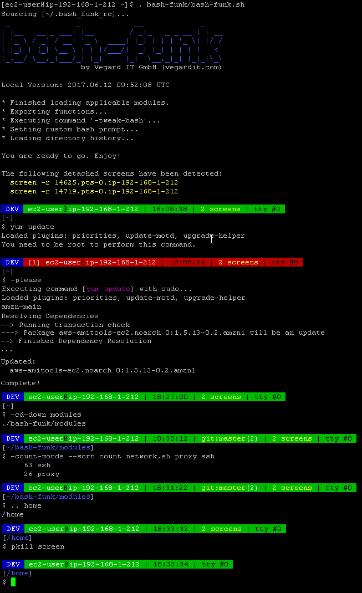

# bash-funk - Spice up your Bash! <a href="https://github.com/vegardit/bash-funk/" title="GitHub Repo"></a>

[](https://github.com/vegardit/bash-funk/actions?query=workflow%3ABuild)
[](https://travis-ci.com/vegardit/bash-funk)
[](#license)
[](CODE_OF_CONDUCT.md)

1. [What is it?](#what-is-it)
1. [Installation](#install)
    1. [Using git](#install-with-git)
    1. [Using subversion](#install-with-svn)
    1. [Using curl](#install-with-curl)
    1. [Using wget](#install-with-wget)
    1. [Portable on Windows](#install-win-portable)
1. [Usage](#usage)
   1. [Customization](#customization)
   1. [Directory-scoped Environment Variables and Aliases](#bash_funk_dir_rc)
   1. [Efficiently navigating the filesystem](#efficient_fs_navigation)
   1. [Using bash-funk modules separately](#using_modules_separately)
1. [Updating](#update)
1. [License](#license)


## <a name="what-is-it"></a>What is it?

bash-funk is a collection of useful commands for Bash 3.2 or higher.

See the markdown files of the different [Bash modules](docs) for detailed information about the provided commands:
  * [ansi](docs/ansi.md) - ANSI colored text output
  * [aws](docs/aws.md) - query information about Amazon WebServices (AWS)
  * [compression](docs/compression.md) - file compression
  * [crypto](docs/crypto.md) - encryption and checksums
  * [docker](docs/docker.md) - Docker and Docker Swarm management
  * [filesystem](docs/filesystem.md) - filesystem navigation and file operations
  * [git](docs/git.md) - working with GIT repositories
  * [math](docs/math.md) - mathematical operations
  * [memory](docs/memory.md) - query RAM information
  * [misc](docs/misc.md) - useful commands that did not yet made it into a separate module
  * [network](docs/network.md) - query network information
  * [openssl](docs/openssl.md) - generate certificates and CAs with OpenSSL
  * [os](docs/os.md) - query presence of commands and installed software packages
  * [performance](docs/performance.md) - test CPU, disk and network performance
  * [processes](docs/processes.md) - query process information or kill processes by parent PID or used TCP ports
  * [random](docs/random.md) - generate random strings
  * [ssh](docs/ssh.md) - SSH key management operations
  * [strings](docs/strings.md) - String manipulations

An adaptive bash prompt is provided too:



All bash-funk commands have a descriptive online help:


The command [-help](docs/misc.md#-help) shows a list of all available commands


## <a name="install"></a>Installation

### <a name="install-with-git"></a>Using Git

Execute:
```bash
git clone https://github.com/vegardit/bash-funk --branch master --single-branch ~/bash-funk
```

### <a name="install-with-svn"></a>Using Subversion

Execute:
```bash
svn checkout https://github.com/vegardit/bash-funk/trunk ~/bash-funk
```

### <a name="install-with-curl"></a>Using Curl

Execute:
```bash
mkdir ~/bash-funk && \
cd ~/bash-funk && \
curl -#L https://github.com/vegardit/bash-funk/tarball/master | tar -xzv --strip-components 1
```

### <a name="install-with-wget"></a>Using wget

Execute:
```bash
mkdir ~/bash-funk && \
cd ~/bash-funk && \
wget -qO- --show-progress https://github.com/vegardit/bash-funk/tarball/master | tar -xzv --strip-components 1
```

### <a name="install-win-portable"></a>Portable on Windows

For your convenience we created a simple bootstrap Windows batch file that sets up a portable [Cygwin](http://cygwin.org) installation pre-configured with bash-funk.

For more details see https://github.com/vegardit/cygwin-portable-installer#install.


## <a name="usage"></a>Usage

Once bash-funk is installed, it can be used by sourcing the `bash-funk.sh` script which will then load all modules.

```bash
$ source ~/bash-funk/bash-funk.sh
```

All bash-funk commands are prefixed with a `-` by default and support the `--help` option.

Bash completion for options is supported by all commands too, simply type a dash (-) and hit the [TAB] key twice.


### <a name="customization"></a>Customization

The following environment variables can be set in `~/.bash_funk_rc` to customize bash-funk's behavior. This file will be sourced automatically.

- `BASH_FUNK_PREFIX` - if specified, the names of all bash-funk commands will be prefixed with this value. Must only contain alphanumeric characters `a-z`, `A-Z`, `0-9`) and underscore `_`.
- `BASH_FUNK_DIRS_COLOR` - ANSI color code to be used by the bash prompt to highlight directories, default is `94` which will be transformed to `\e[94m`
- `BASH_FUNK_NO_EXPORT_FUNCTIONS` - if set to any value bash-funk commands are not exported to sub-shells, thus will not be available in your own shell scripts.
- `BASH_FUNK_NO_TWEAK_BASH` - if set to any value bash-funk will not automatically invoke the [-tweak-bash](docs/misc.md#-tweak-bash) command when loading.
- `BASH_FUNK_NO_PROMPT` - if set to any value bash-funk will not install it's Bash prompt function.
- `BASH_FUNK_PROMPT_PREFIX` - text that shall be shown at the beginning of the Bash prompt, e.g. a stage identifier (DEV/TEST/PROD)
- `BASH_FUNK_PROMPT_DATE` - prompt escape sequence for the date section, default is `\t`, which displays current time. See http://tldp.org/HOWTO/Bash-Prompt-HOWTO/bash-prompt-escape-sequences.html
- `BASH_FUNK_PROMPT_NO_JOBS` - if set to any value the Bash prompt will not display the number of shell jobs.
- `BASH_FUNK_PROMPT_NO_SCREENS` - if set to any value the Bash prompt will not display the number of detached screens
- `BASH_FUNK_PROMPT_NO_TTY` - if set to any value the Bash prompt will not display the current tty.
- `BASH_FUNK_PROMPT_NO_KUBECTL` - if set to any value the Bash prompt will not display [kubectl](https://kubernetes.io/docs/reference/kubectl/)'s current context
- `BASH_FUNK_PROMPT_NO_GIT` - if set to any value the Bash prompt will not display GIT branch and modification information.
- `BASH_FUNK_PROMPT_NO_SVN` - if set to any value the Bash prompt will not display SVN branch and modification information.


### <a name="bash_funk_dir_rc"></a>Directory-scoped Environment Variables and Aliases

When changing into a directory, the bash-funk Bash prompt can automatically evaluate `.bash_funk_dir_rc` files found in the current directory or it's parent directories
to set context-relevant environment variables.

*This feature is disabled by default.* To enable it, define the variable `BASH_FUNK_PROMPT_DIRENV_AUTHORIZED_DIRS` in `~/.bash_funk_rc` as an Bash array containing fully qualified paths to trusted directories.
Only `.bash_funk_dir_rc` files found in these directories will be evaluated for security reasons. The entries in `BASH_FUNK_PROMPT_DIRENV_AUTHORIZED_DIRS` may also expressed as a variant of [glob patterns](https://www.gnu.org/software/bash/manual/html_node/Pattern-Matching.html),
where `*` will match one directory level and `**` any directory level.

The `.bash_funk_dir_rc` are executed in a sub-shell, whose output is captured and parsed. All lines matching the pattern `export <VARNAME>=<VALUE>` or `alias <VARNAME>=<VALUE>` will then be executed via `eval` in the context of the current shell.

If multiple files named `.bash_funk_dir_rc` are found in the directory hierarchy (from the current directory up to `/`), they will be all evaluated starting with the file at the highest level (i.e. /).

Here is an example setup:

1. A file at `/opt/projects/.bash_funk_dir_rc` containing:
    ```bash
    #!/usr/bin/env bash
    echo "export JAVA_VERSION=1.8"
    echo "export MAVEN_VERSION=3.5"
    ```
1. A file at `/opt/projects/project1/.bash_funk_dir_rc` containing:
    ```bash
    #!/usr/bin/env bash

    # override JAVA_VERSION=1.8 from /opt/projects/.bash_funk_dir_rc
    echo "export JAVA_VERSION=9"
    ```
1. `BASH_FUNK_PROMPT_DIRENV_TRUSTED_DIRS` in `~/.bash_funk_rc`, either explicit:
    ```bash
    BASH_FUNK_PROMPT_DIRENV_TRUSTED_DIRS=(
      "/opt/projects"
      "/opt/projects/project1"
      "/opt/projects/project2"
    )
    ```
    or with single-level pattern matching
    ```bash
    BASH_FUNK_PROMPT_DIRENV_TRUSTED_DIRS=(
      "/opt/projects/*"
    )
    ```
    or with multi-level pattern matching
    ```bash
    BASH_FUNK_PROMPT_DIRENV_TRUSTED_DIRS=(
      "/opt/**"
    )
    ```
1. If you now `cd` into `/opt/projects/project1/` the environment variables `JAVA_VERSION=9` and `MAVEN_VERSION=3.5` are present.
1. If you go one level up to `/opt/projects/`, `JAVA_VERSION=1.8` will be set.
1. If you go one level up to `/opt`, the environment variables `JAVA_VERSION` and `MAVEN_VERSION` will be unset.
1. If you comment out the first entry in `BASH_FUNK_PROMPT_DIRENV_TRUSTED_DIRS` in `~/.bash_funk_rc`:
    ```bash
    BASH_FUNK_PROMPT_DIRENV_TRUSTED_DIRS=(
      #"/opt/projects"
      "/opt/projects/project1"
      "/opt/projects/project2"
    )
    ```
    and again `cd` into `/opt/projects/project1/` only the environment variables `JAVA_VERSION=9` will be present
    as the `/opt/projects/.bash_funk_dir_rc` is not evaluated anymore.


### <a name="efficient_fs_navigation"></a>Efficiently navigating the filesystem

1. Navigating **up** the directory tree

   1. Navigating to the parent directory:
      <pre>
      [me@local /opt/projects/project1/src/main/java/com/<b>acme</b>] $ <b>..</b>
      [me@local /opt/projects/project1/src/main/java/com] $
      </pre>

   1. Navigating to the parent's parent directory:
      <pre>
      [me@local /opt/projects/project1/src/main/java/<b>com/acme</b>] $ <b>...</b>
      [me@local /opt/projects/project1/src/main/java] $
      </pre>

   1. Navigating up n-levels:
      <pre>
      [me@local /opt/projects/project1/<b>src/main/java/com/acme</b>] $ .. 5
      [me@local /opt/projects/project1] $
      </pre>

   1. Navigating up to a directory with a given name:
      <pre>
      [me@local /opt/projects/<b>project1</b>/src/main/java/com/acme] $ .. <b>project1</b>
      [me@local /opt/projects/project1] $
      </pre>

   **Note:** `..` is an alias for the command <a href="docs/filesystem.md#-cd-up">-cd-up</a> which you also can use, e.g. `-cd-up 5`

1. Navigating **down** the directory tree to a directory with a given name:

   <pre>
   [me@local /opt/projects/project1] $ ++ <b>acme</b>
   [me@local /opt/projects/project1/src/main/java/com/<b>acme</b>] $
   </pre>

   **Note:**  `++` is an alias for <a href="docs/filesystem.md#-cd-up">-cd-down</a> which you also can use, e.g. `-cd-down acme`

1. Navigating **back** in the directory history

   1. Navigate back to the last visited directory:
      <pre>
      [me@local /var/log/project1/<b>mod1</b>] $ cd /opt/projects/project1
      [me@local /opt/projects/project1] $ -
      [me@local /var/log/project1/<b>mod1</b>] $
      </pre>

   1. Navigate back to a directory with a given name:
      <pre>
      [me@local /var/log/project1/<b>mod1</b>] $ cd /opt/projects/project1
      [me@local /opt/projects/project1] $ cd /opt/projects/project2
      [me@local /opt/projects/project2] $ cd /var/log/project2/mod2
      [me@local /var/log/project2/mod2] $ -- <b>mod1</b>
      [me@local /var/log/project1/<b>mod1</b>] $
      </pre>

   1. Navigate back to the n-last visited directory:
      <pre>
      [me@local /var/log/project1/<b>mod1</b>] $ cd /opt/projects/project1
      [me@local /opt/projects/project1] $ cd /opt/projects/project2
      [me@local /opt/projects/project2] $ cd /var/log/project2/mod2
      [me@local /var/log/project2/mod2] $ -- <b>3</b>
      [me@local /var/log/project1/<b>mod1</b>] $
      </pre>

   **Note:** `--` is an alias for <a href="docs/filesystem.md#-cd-up">-cd-hist</a> which you also can use, e.g. `-cd-hist mod1`


### <a name="using_modules_separately"></a>Using bash-funk modules separately

All bash-funk modules are self-containing. This means, if you are only interested in the commands provided by one module, you can also directly source that particular module located in the `modules` folder and do not use the `bash-funk.sh` loader script.


## <a name="update"></a>Updating

Once loaded, you can easily update your bash-funk installation to the latest code base by using the [-update](docs/misc.md#-update) command:

```bash
-update -yr
```

or:

```bash
-update --yes --reload
```


## <a name="license"></a>License

All files are released under the [Apache License 2.0](LICENSE.txt).

Individual files contain the following tag instead of the full license text:
```
SPDX-License-Identifier: Apache-2.0
```

This enables machine processing of license information based on the SPDX License Identifiers that are available here: https://spdx.org/licenses/.